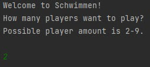
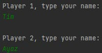
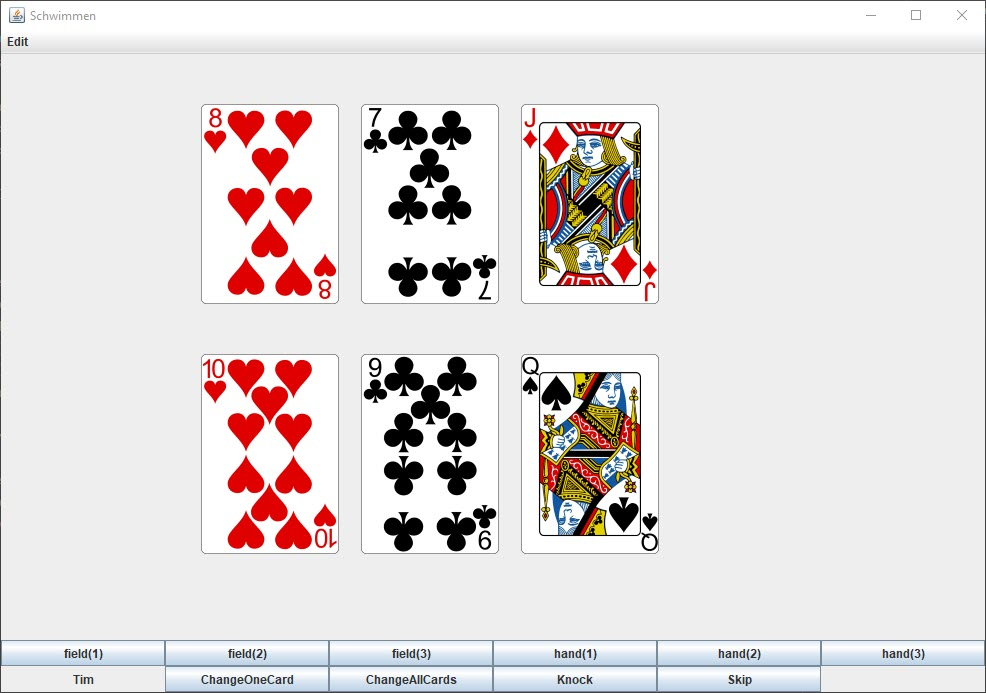
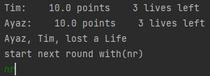

# Schwimmen

Aka Einunddreißig or ThirtyOne is a cardgame played with 32 cards and up to nine players.

# Rules:

Every Player is getting three cards. The goal of the game is to not be the one with the smallest card value. To achieve this
goal the player can swap either one or all of his cards with the three cards on the field, he is also allowed to skip a 
round or to "knock", which means that there's one last round left til the cards are counted.
When two cards have the same colour(for example spades) their value is added together.
The Value of a card is defined as followed:
* An ace has a value of 11
* A face card such as king, queen or jack has a value of 10
* Every card with a number has a value of this very number
* Three cards of the same face or number but different colour is defined as a value of 30 1/2

# How to play our version:

>First of all you have to type with how many players you want to play. It is possible to play with up to nine players.
\

>After that you can give every player a name.
\

>Now the game can start and a GUI will pop up.
\

\
> In the bottom left corner you can see the name of the current player. This player can now decide if he wants to:
> * change one of his cards by selecting the card of the field he wants to get and the card of his hand he wants to
> throw on the field and by pressing the ChangeOneCard button afterwards.
> * change all of his cards by pressing the ChangeAllCards button.
> * knock by pressing the Knock button, doing that will end the game after the next round.
> * skip this round by pressing the Skip button.

>The game will either end by someone who knocked or if someone gets 31 points which is called a stop.
>To continue the game u have to type "nr" and the player with the least points loose one life.
\

\
> If a player has no more lives left he will be removed from the game and the rest of the players can continue playing
> til only one player is left.

# Help:

* It is possible to undo/redo a swap or knock or skip by using the edit menu in the GUI or by typing undo/redo in the TUI
* It is possible to save/load a game by typing saveJson/loadJson in the TUI

# Build and Coverage (Masterbranch):

